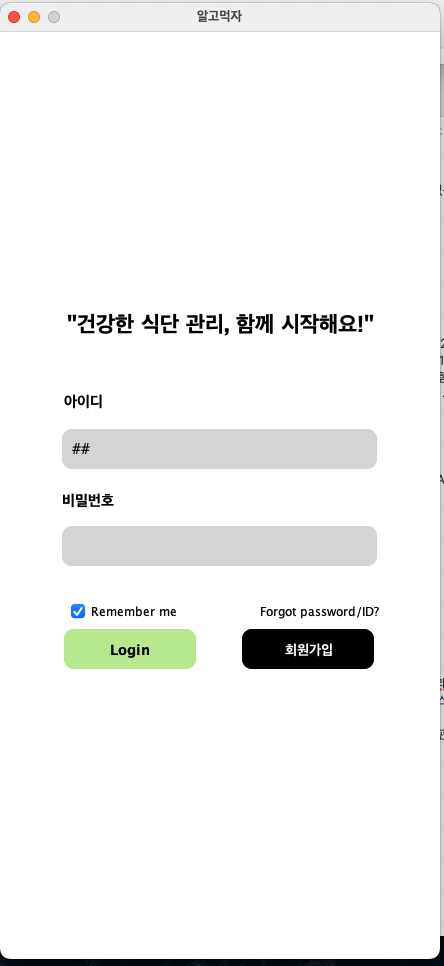
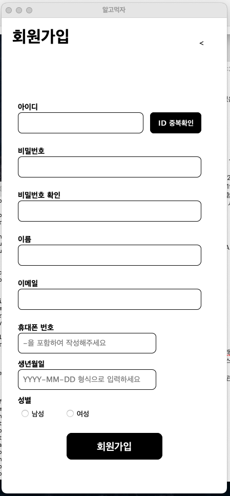
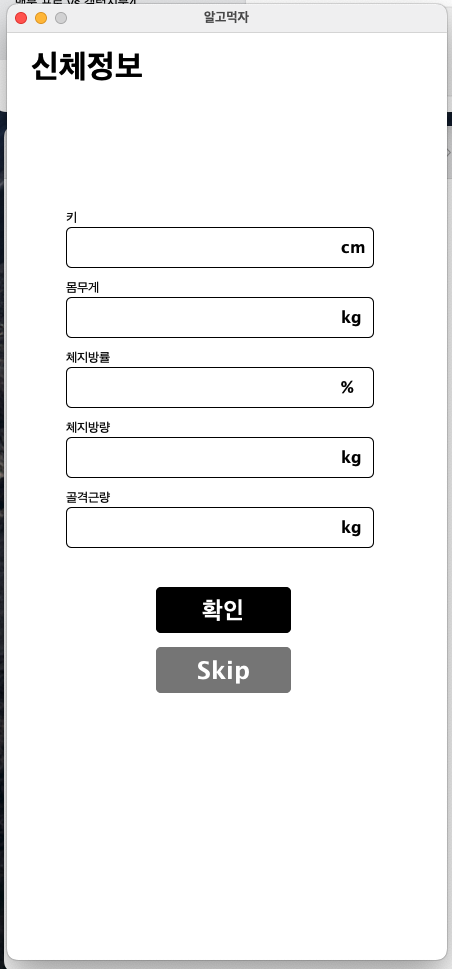
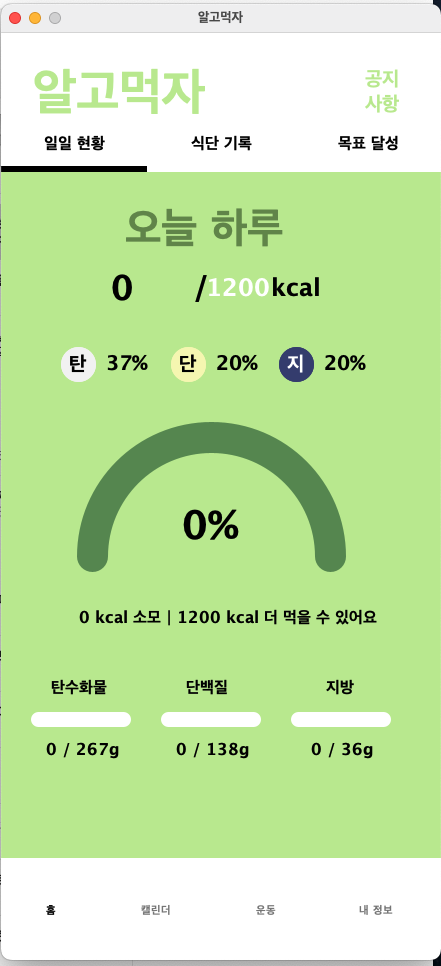
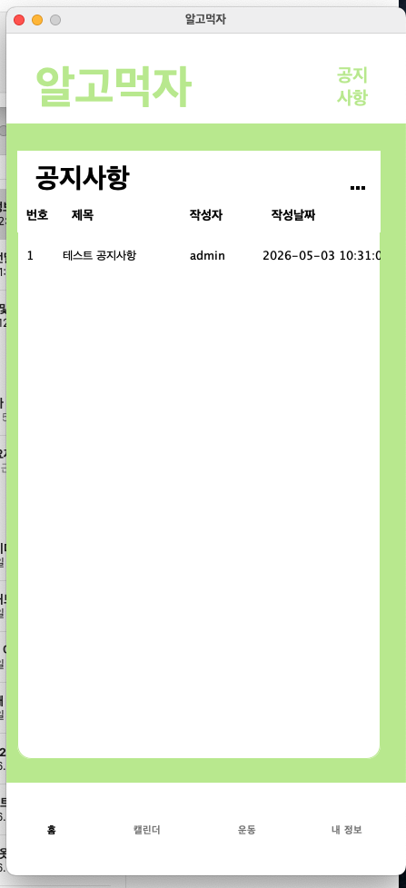

# 알고먹자 - Java Swing 식단 관리 프로그램

## 프로젝트 소개

알고먹자는 Java Swing 기반의 데스크톱 식단 및 건강 관리 프로그램입니다.  
사용자는 회원가입과 로그인을 통해 식단, 음식 정보, 운동 정보, 공지사항 등을 확인할 수 있으며, 관리자는 공지사항을 관리할 수 있습니다.

이 프로젝트는 기존 Eclipse 기반 Java 프로젝트를 macOS 환경에서 복구하고, MySQL 연동 및 실행 오류를 수정하여 포트폴리오용으로 정리한 프로젝트입니다.

이 프로젝트는 기존 Eclipse 기반 Java 프로젝트를 macOS 환경에서 복구하고, MySQL 연동 및 실행 오류를 수정하여 포트폴리오용으로 정리한 프로젝트입니다.

## 관련 문서

- [프로젝트 트러블슈팅 기록](docs/troubleshooting.md)
- [데이터베이스 설정 방법](README_DB_CONFIG.md)

## 주요 기능

## 주요 기능

### 사용자 기능

#### 회원가입 및 로그인

- 사용자는 아이디, 비밀번호, 이름, 전화번호, 이메일, 생년월일, 성별 정보를 입력하여 회원가입할 수 있습니다.
- 회원가입 시 아이디, 이메일, 전화번호 중복 여부를 확인합니다.
- 로그인 성공 시 사용자 세션을 저장하여 이후 화면에서 로그인 사용자의 정보를 활용합니다.

#### 신체정보 입력

- 회원가입 후 키, 몸무게, 체지방률, 체지방량, 골격근량 등의 신체정보를 입력할 수 있습니다.
- 신체정보 입력을 원하지 않는 경우 Skip 버튼을 통해 메인 화면으로 이동할 수 있습니다.
- 기존에는 Skip 버튼 클릭 시 로그인 화면으로 이동하는 문제가 있었으며, 이를 사용자 메인 화면으로 이동하도록 수정했습니다.

#### 음식 정보 조회 및 검색

- 음식 목록을 조회할 수 있습니다.
- 음식 이름을 기준으로 검색할 수 있습니다.
- 음식별 칼로리, 탄수화물, 단백질, 지방 정보를 확인할 수 있습니다.

#### 식단 기록 및 영양소 조회

- 사용자의 식사 기록을 저장할 수 있는 구조를 제공합니다.
- 식사별 음식 정보를 기반으로 칼로리, 탄수화물, 단백질, 지방 섭취량을 계산할 수 있습니다.
- 오늘 섭취한 영양소 정보를 조회할 수 있습니다.

#### 운동 정보 조회

- 운동 정보를 카테고리별로 조회할 수 있습니다.
- 운동명, 운동 부위/카테고리, 운동 유형, MET 값을 관리합니다.
- 운동 기록을 기반으로 일일 소모 칼로리를 계산할 수 있는 구조를 제공합니다.

#### 공지사항 조회

- 사용자는 등록된 공지사항 목록을 확인할 수 있습니다.
- 공지사항 제목, 작성자, 작성일 정보를 확인할 수 있습니다.
- 공지사항 상세 내용을 조회할 수 있습니다.

### 관리자 기능

#### 관리자 로그인

- 일반 사용자와 관리자를 구분하여 로그인합니다.
- 관리자 계정은 별도의 `admin` 테이블을 통해 관리됩니다.
- 테스트용 관리자 계정은 `schema.sql` 실행 시 자동 생성됩니다.

#### 공지사항 관리

- 관리자는 공지사항을 조회할 수 있습니다.
- 공지사항 작성, 수정, 삭제 기능을 위한 DAO 및 화면 구조를 포함하고 있습니다.
- 공지사항 첨부파일 관리를 위한 `notice_files` 테이블 구조를 포함하고 있습니다.

### 데이터베이스 연동 기능

- MySQL 데이터베이스와 JDBC를 통해 연동합니다.
- DB 접속 정보는 `src/db.properties` 파일로 분리했습니다.
- 실제 비밀번호가 포함된 `db.properties`는 Git 추적에서 제외하고, 예시 파일인 `db.properties.example`만 제공합니다.
- `sql/schema.sql`을 통해 데이터베이스, 테이블, 테스트 데이터를 재생성할 수 있도록 정리했습니다.

### 복구 및 개선한 기능

- Windows 환경 기준으로 설정되어 있던 MySQL Connector 경로 문제를 macOS 환경에 맞게 수정했습니다.
- 프로젝트 폴더의 read-only 권한 문제를 해결하여 Eclipse 빌드가 가능하도록 복구했습니다.
- 누락된 MySQL 테이블을 DAO 코드 기준으로 분석하여 생성했습니다.
- 관리자 로그인, 일반 사용자 회원가입, 음식/운동/공지사항 조회 흐름을 확인했습니다.
- 신체정보 입력 화면에서 Skip 버튼 클릭 시 로그인 화면으로 돌아가던 화면 전환 문제를 수정했습니다.

## 화면 미리보기

### 로그인 화면


### 회원가입 화면


### 신체정보 입력 화면


### 사용자 메인 화면


### 공지사항 화면



## 기술 스택

- Java
- Java Swing
- Eclipse IDE
- MySQL 8.0
- MySQL Connector/J
- Git
- GitHub

## 개발 및 실행 환경

| 항목 | 내용 |
|---|---|
| OS | macOS |
| JDK | Eclipse Temurin JDK 21 |
| IDE | Eclipse IDE for Java Developers |
| DB | MySQL Community Server 8.0 |
| JDBC Driver | MySQL Connector/J 9.7.0 |
| Build 방식 | Eclipse Java Project |

## 프로젝트 실행 방법

이 프로젝트는 Eclipse 기반 Java Swing 프로젝트입니다.  
실행을 위해서는 JDK, MySQL Server, MySQL Connector/J 설정이 필요합니다.

### 1. JDK 설치 확인

JDK 21 이상을 설치한 뒤 터미널에서 아래 명령어로 확인합니다.

```bash
java -version
javac -version
```

### 2. MySQL Server 설치 및 실행 확인

MySQL Community Server 8.0 이상을 설치합니다.

macOS에서 MySQL 공식 설치 파일을 사용한 경우, 터미널에서 아래 명령어로 접속할 수 있습니다.

```bash
/usr/local/mysql/bin/mysql -u root -p
```

비밀번호 입력 후 아래처럼 표시되면 정상 접속입니다.

```text
mysql>
```

### 3. 데이터베이스 및 테이블 생성

MySQL에 접속한 뒤, 프로젝트에 포함된 `sql/schema.sql` 파일을 실행합니다.

예시:

```sql
SOURCE /Users/사용자명/Downloads/project8/sql/schema.sql;
```

또는 `schema.sql` 파일 내용을 MySQL 콘솔에 직접 붙여넣어 실행할 수 있습니다.

`schema.sql` 실행 시 다음 항목이 생성됩니다.

- `almja` 데이터베이스
- `admin` 테이블
- `user` 테이블
- `food` 테이블
- `exercise` 테이블
- `exercise_log` 테이블
- `notice` 테이블
- `notice_files` 테이블
- `meal` 테이블
- `meal_log` 테이블
- 테스트 관리자 계정
- 기본 음식/운동/공지사항 테스트 데이터

### 4. DB 설정 파일 생성

`src/db.properties.example` 파일을 복사하여 `src/db.properties` 파일을 생성합니다.

예시:

```properties
db.driver=com.mysql.cj.jdbc.Driver
db.url=jdbc:mysql://localhost:3306/almja?characterEncoding=UTF-8&serverTimezone=UTC
db.user=root
db.password=your_password_here
```

`db.password`에는 본인의 MySQL root 비밀번호를 입력합니다.

보안상 `src/db.properties`는 `.gitignore`에 포함되어 있으며 GitHub에 업로드하지 않습니다.

### 5. Eclipse에서 프로젝트 Import

Eclipse에서 아래 순서로 프로젝트를 가져옵니다.

1. `File`
2. `Import`
3. `General`
4. `Existing Projects into Workspace`
5. 프로젝트 루트 폴더 선택
6. `Finish`

### 6. MySQL Connector/J 설정

프로젝트에 MySQL Connector/J 라이브러리가 필요합니다.

Eclipse에서 아래 순서로 `.jar` 파일을 추가합니다.

1. 프로젝트 우클릭
2. `Properties`
3. `Java Build Path`
4. `Libraries`
5. `Classpath` 선택
6. `Add External JARs...`
7. `mysql-connector-j-x.x.x.jar` 선택
8. `Apply and Close`

현재 복구 환경에서는 `mysql-connector-j-9.7.0.jar`를 사용했습니다.

### 7. 프로젝트 실행

Eclipse에서 아래 파일을 실행합니다.

```text
src/main/MainFrame.java
```

실행 방법:

1. `MainFrame.java` 우클릭
2. `Run As`
3. `Java Application`

실행에 성공하면 `알고먹자` 로그인 화면이 표시됩니다.

## 현재 알려진 문제 및 개선 필요 사항

이 프로젝트는 기존 Eclipse 기반 Java Swing 프로젝트를 macOS 환경에서 복구한 상태입니다.  
현재 기본 실행, 관리자 로그인, 사용자 회원가입, 주요 화면 진입은 가능하지만, 포트폴리오 완성도를 높이기 위해 다음 개선이 필요합니다.

### 1. 콘솔 디버그 로그 정리

현재 실행 중 콘솔에 디버깅용 로그가 많이 출력됩니다.

예시:

```text
로그인된 사용자가 없습니다.
FoodDAO: 검색 수행
공지사항 UI 업데이트 시작
현재 로그인된 사용자 ID: null